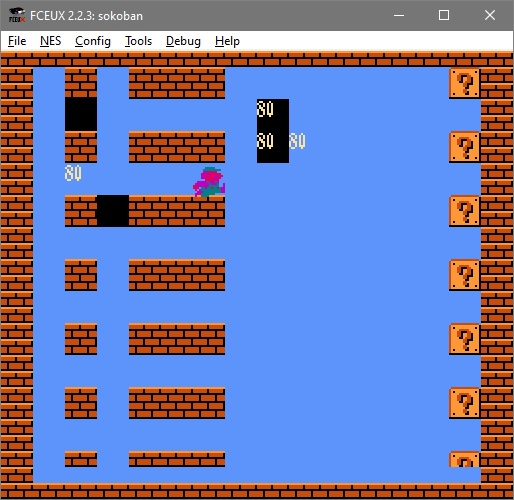

# nes-sokoban
I was interested some years ago how I can write games for NES, so result is sokoban-like game.
It's not perfect, but it was fun little project!

## How to compile it?
It's simply. Use NESASM3, like: ```NESASM3 src/sokoban.asm``` and it will generate binary you can run.

